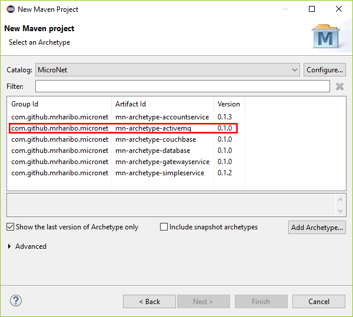
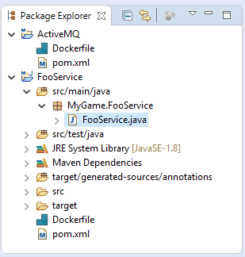
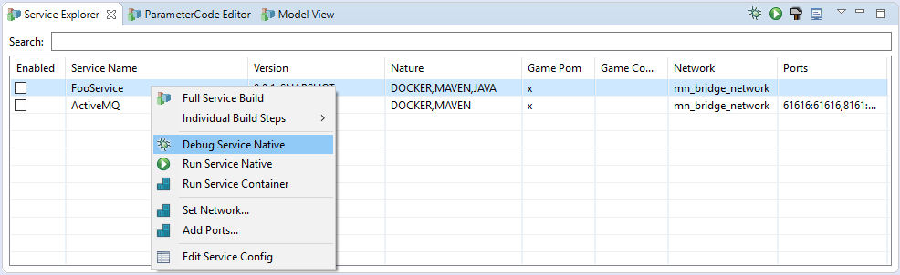
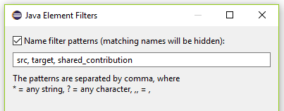

# Basic MicroNet Communication

- [Getting Started Tutorial](../index.md)
  - [Installation](../gettingstarted/index.md)
  - [Basic Communication](../communicationtutorial/index.md)
    - [Adding ActiveMQ](#adding-activemq)
    - [Creating a Loopback Service](#creating-a-loopback-service)
    - [Adding a Communication Partner](#adding-a-communication-partner)
    - [Whats Next](#whats-next)
  - [User Management](../usermanagement/index.md)
  - [Simple Example Game](../tutorial/index.md)
- [Quick Reference](../quickreference/index.md)

In this tutorial you try out basic connectivity between Microservices using the default MessageBroker ActiveMQ. It is assumed that you have the *Docker Engine* and *Eclipse IDE* installed and have performed all necessary workspace modifications as explained on page [Installation](../gettingstarted/index.md).

## Adding ActiveMQ

In this first step you will add ActiveMQ to your game workspace as a *Service Project*. Open the *New Project* dialog via the *Project Explorer* or the *File* menu. In the dialog select *Maven -> Maven Project* and press next twice to display the archetype selection page. Select the MicroNet Archetype Catalog and choose the *mn-archetype-activemq* archetype as shown in the image below. Press next and edit the metadata of the ActiveMQ project. The artifactId can be chosen arbitrary but the groupId should match the groupId in the Game Workspace metadata. Press finish to create the project.



To test ActiveMQ find it in the Service Explorer view and right click it to open the context menu. Execute the **Full Service Build** action and observe the build output in the console. If the build was successful you can start ActiveMQ via the context menu with the **Run Service Container** button.

> To verify that ActiveMQ is running you can use the **Docker Explorer** provided by the *Docker Tools for Eclipse* which can be found in the Eclipse marketplace. Once installed open the *Docker Explorer* view over *Window -> Show View -> Other -> Docker -> Docker Explorer*. In the Docker Explorer locate the ActiveMQ container and verify that it is running. The desired state is shown in the image below.


> You can also access the ActiveMQ *Web Console* with your browser to observe the state of ActiveMQ. The Web Console is avaibale under http://localhost:8161/admin/ and the deault username/password are "admin"/"admin". For production change the admin credentials as explained on the [ActiveMQ Dockerhub Page](https://hub.docker.com/r/webcenter/activemq/).

## Creating a Loopback Service

Services can communicate with each other or can send messages to themself. The first service that you will create will do exatly that, sending a message to itself.

> Be aware that if multiple instances of one service are deployed it not guaranteed that the same service who sent the message will also receive the message again.

Use the MicroNet Service Catalog add the *mn-archetype-simpleservice* to your game workspace in the same fashion you added ActiveMQ. Name the artifactId **FooService**. Upon confirmation a Maven Java *Service Project* will be created in the workspace. In the Service Project expand the *src/main/java* folder and locate the *MyGame.FooService.FooService.java* class as shown in the picture below.



This class can be though of as the *Main Class* of the service and is used as an entrypoint to inject domain logic into the service. The Service created by the *mn-archetype-simpleservice* archetype is already prepared to be tested right away. Make shure ActiveMQ is running and start the container as a local Java application using the context menu action *Debug/RunServiceNative* in the Service Explorer as shwon in the image below. Observe the console as the service starts up and send itself a message. You can also perform a *Full Service Build* and start the service in a container but be shure to remove it afterwards via the Docker Explorer or you wont be able to start again due to a naming collision.



> Note that at the moment it is not possible to locally run the same container twice for testing. This feature is planned to be added in the future. Meanwhile you can use Docker Swarm to deploy multiple instances of the same container using the *docker service* CLI.

> Tip: If you think a Service Project shows way to many folders in the Project Explorer as I do :) add a new *Filter* via the *Drop Down* menu of the Project Explorer. Add "src, target, shared_contribution" as Name filter patterns as shwon in the image below. You can also check the *Libraries from external* checkbox for exclude but to the library folders are sometimes useful.



## Adding a Communication Partner

One service of course does not make up a very interessting distributed application so we spice thing up a little by adding a communication partner for our lonely *FooService*. But before we do that, we need to enshure that we give FooService a proper address so it can be found by other services or later by the users of the application. In the Main Class of FooService edit the `@MessageService` annotation and enter a valid URI like for example "mn://foo". The protocol portion "mn://" of the URI is required for a service to be recognized by a MicroNet application. Also in the ServiceFoo class remove the 

```java
context.sendRequest("mn://my_service/hello/world/handler", new Request("Hello"));
``` 
call from the start method since the service "mn://my_service" no longer exists. In the end the FooService should look like this:

```java
@MessageService(uri = "mn://foo")
public class FooService {
	
	@OnStart
	public void onStart(Context context) {
		System.out.println("FooService Start Routine...");
	}
	
	@MessageListener(uri="/hello/world/handler")
	public void helloHandler(Context context, Request request) {
		System.out.println(request.getData() + " World MicroNet...");
	}
}
```

Now add another *mn-archetype-simpleservice* archetype project to your game workspace and name the artifactId **BarService**. In the Main Class of the BarService change the `@MessageService` and enter a valid URI for the service for example "mn://bar". Change the call in the BarService Main Class from 

```java
context.sendRequest("mn://my_service/hello/world/handler", new Request("Hello"));
```

to

```java
context.sendRequest("mn://foo/hello/world/handler", new Request("Hello from Bar"));
```

You can also remove the `helloHandler` method from the BarService to keep it clean (Microservice style). The resulting BarService should look like this:

```java
@MessageService(uri = "mn://bar")
public class BarService {
	
	@OnStart
	public void onStart(Context context) {
		System.out.println("BarService Start Routine...");
		context.sendRequest("mn://foo/hello/world/handler", new Request("Hello from Bar"));
	}
}
```

To test the communication between the two services you must first enshure that no old service instances are running to interfere with our new services. Check this on the *Debug View* in the Java *Debug Perspective* and in the container section in the *Docker Explorer*. You can leave ActiveMQ running because we still need it. After cleaning start both services Using your prefered method. The order does not matter since the message that is sent by BarService buffered by ActiveMQ and is delivered as soon as FooService is available. Observe the Console of both services to see if the communication was successful.

## Whats Next

Now that you could establish a simple service communication you can add more complex features to you Game Workspace. Move on to the [User Management Tutorial](../usermanagement/index.md) Tutorial.
