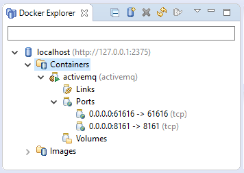

# Simple MicroNet Communication

In this tutorial you tryout basic connectivity between Microservices using the default MessageBroker ActiveMQ.

## Adding ActiveMQ

In this first step you will add ActiveMQ to your game workspace. Open the *New Project* dialog via the *Project Explorer* or the *File* menu. In the dialog select *Maven -> Maven Project* and press next until the archetype selection page. Select the MicroNet Archetype Catalog and choose the *mn-archetype-activemq* archetype. Press next and edit the metadata of the ActiveMQ project. The artifactId can be chosen arbitrary but the groupId should match the groupId from the game workspace metadata. Press finish to create the project.

To test ActiveMQ find it in the service explorer and right click it to open the context menu. Execute the **Full Service Build** action and observe the build output in the console. If the build was successful you can start ActiveMQ via the context menu with the **Run Service Container** button.

> To verify that ActiveMQ is running you can use the Docker Explorer provided by the *Docker Tools for Eclipse* which can be found in the Eclipse marketplace. Once installed open the *Docker Explorer* view over *Window -> Show View -> Other -> Docker -> Docker Explorer*. In the Docker Explorer locate the ActiveMQ container and verify that it is running. The desired state is shown in the image below.

