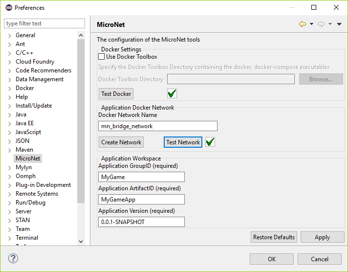

# Installation

- [Getting Started Tutorial](../index.md)
  - [Installation](index.md)
    - [Docker Installation](#docker-installation)
    - [Eclipse Installation](#eclipse-installation)
    - [Workspace Setup](#workspace-setup)
    - [Whats Next](#whats-next)
  - [Basic Communication](../communicationtutorial/index.md)
  - [User Management](../usermanagement/index.md)
  - [Simple Example Game](../tutorial/index.md)
- [Quick Reference](../quickreference/index.md)

MicroNet itself does not require any installation but it requires both a **Docker Engine** and an **Eclipse IDE** installation on the developers host. MicroNet was developed with Microsoft Windows but also works under Linux, and MacOS. The MicroNet Tools however are only tested in Windows. 

## Docker Installation

The most convenient way to use docker on a developer's computer is by installing the **Docker Desktop** version which is available for *MacOS* and *Microsoft Windows 10 Professional*. On Linux a native docker installation can be used.  

### Windows
On Windows a Windows Pro version is required to use Docker Desktop because it requires **HyperV** to be enabled which is not possible on Windows Home Editions (see requirements in [Install Docker for Windows](https://docs.docker.com/docker-for-windows/install/)). If you have Windows 10 Pro, enable **HyperV** as explained in the Windows documentation [Install Hyper-V on Windows 10](https://docs.microsoft.com/en-us/virtualization/hyper-v-on-windows/quick-start/enable-hyper-v). Afterwards download and install the appropriate **Docker Desktop** client which can be found via the [Official Docker Installation Documentation](https://docs.docker.com/engine/installation/).

If you don't have Windows 10 Pro the best alternative solution is to use the [Docker Toolbox](#docker-toolbox) as explained [below](#docker-toolbox). In any case test your docker installation using the for example the `docker info` command.

### Linux

On Linux choose the appropriate installation guide for your Linux opperating system: 
[Ubuntu](https://docs.docker.com/engine/installation/linux/docker-ce/ubuntu/), 
[Debian](https://docs.docker.com/engine/installation/linux/docker-ce/debian/), 
[CentOS](https://docs.docker.com/engine/installation/linux/docker-ce/centos/), or
[Fedora](https://docs.docker.com/engine/installation/linux/docker-ce/fedora/).

> MicroNet has not been tested on Linux Operating Systems 

### MacOS

On Mac follow the official Docker [Installation Manual for MacOS](https://docs.docker.com/docker-for-mac/install/).

> MicroNet has not been tested on MacOS

### Docker Toolbox

A fallback plan if none of the above solutions work is to use **Docker Toolbox**. The Docker Toolbox uses *VirtualBox* as it's virtualization technology which widely supportet also on older operating systems. Use the [Official Docker Toolbox Documentation](https://docs.docker.com/toolbox/overview/) to learn how to install Docker Toolbox.

## Eclipse Installation

An **Eclipse Oxygen** installation is required to use the MicroNet tools. It is recommended to download a new Eclipse Installation and use it solely for MicroNet because the MicroNet tools automatically synchronize specific files in the workspace. You dont want this behaviour for any other workspace than MicroNet workspaces.

Download the *Eclipse IDE for Java Developers* from the [Eclipse Download Page](https://www.eclipse.org/downloads/eclipse-packages/) which is appropriate for your operating system as shown in the image below. Be shure to download the **packaged version** of Eclipse and not the installer to enshure the separation of the Eclipse used by MicroNet to other Eclipse Installations. 

> The Enterprise Edition of Eclipse (Eclipse IDE for Java EE Developers) is not required for MicroNet development and it is therefore not recommended with the goal not to overwhelm the developer with unused IDE funcionalities.

Extract the *eclipse* directory from the archive to you hard drive and start the contained eclipse executable. 

## MicroNet Tools Installation

Once Eclipse is open, navigate to the *Help -> Install New Software...* dialog. Press the *Add...* button in the top right to add a new Update Site to this Eclipse Installation. Enter *MicroNet* as name and add *https://mrharibo.github.io/updatesite/* as location. Choose the MicroNet update site from the "Work with:" dropdown and install the MicroNet plug-in. This plug-in contains all MicroNet Tools.

> Sometimes the MicroNet category is not shown and the check box *Group items by category* must be deselected for MicroNet to show up as indicated in the image below.

### Install Docker Toolbox

Although not mandatory it is recommended to install the *Docker Tools for Eclipse*. The Docker Tools are a handy collection of visual tools that make the management of the Docker Engine more comfortable. The Eclipse Docker Tools can be installed via the Eclipse Marketplace under *Help -> Eclipse Marketplace...*. Just enter "Docker Tools" in the search field as shown in the image below.

## Workspace Setup

When you open Eclipse you will be prompted for a *Workspace Directory*. Every Game developed with MicroNet needs it's own Workspace Directory. You can use the same MicroNet Eclipse installation for multiple games by using different workspaces for each game. In this tutorial a directory called "MyGame" will be used as Workspace Directory.

### MicroNet Settings

The worspace of a game contains a set of metadata wich is automatically generated when the workspace is opened for the first time. The first step after opening the workspace should be to configure the generated metadata according to the game you want to develop. Open the MicroNet global preference page under *Window -> Preferences -> MicroNet*.

#### Docker Settings

Use the Docker Settings section to test if your Docker installation works properly with MicroNet. If you are using Docker Desktop everything should work right away and you can verify that by pressing the *Test Docker* button. If you are using Docker Toolbox specify the Docker Toolbox installation directory and also test your Docker Installation.

#### Application Docker Network

To enshure connectivity among Microservices a custom Docker Network must be created. It is recommended to use a separate network for all games that are developed in parallel to enshure game isolation. Enter a name for the network and press *Create Network*. Test your network right afterwards with the *Test Network* button. You can also use a Docker Network that was created in advance but be shure to test it. In this tutorial *mn_bridge_network* will be used as the network name.

#### Application Workspace

The workspace of a game itself is a Maven project and the projects within the workspace are children of the parent Maven project and represent the Microservices of the application. This actuality is used to build the complete game application in one go. Edit the metadata according to the game you want to develop and apply the changes using the *Apply Application Pom Metadata* button. The changes are automatically flushed to disk. In this tutorial *MyGame* will be used as groupId, *MyGameApp* will be used as artifactId, and *0.0.1-SNAPSHOT* will be used as version.

> Be advised that in the current version 0.1.0 of MicroNet the projects changes to the parent metadata are not updated in in the child projects of the services. Momentarily it is best to define the game Metadata once and leave it unchanged. In case of a change the child pom's need to be updated manually. This feature is planned for the future. 

### Opening the MicroNet Views

As a last step you need to display the MicroNet specific views. Open the *Window -> Show View -> Other* dialog and open all views listed under the MicroNet category.

## Whats Next

If you yould successfully complete the previous steps you are ready to build your first game using MicroNet. Read on in the [Example Game Tutorial](../tutorial/index.md) Page.
