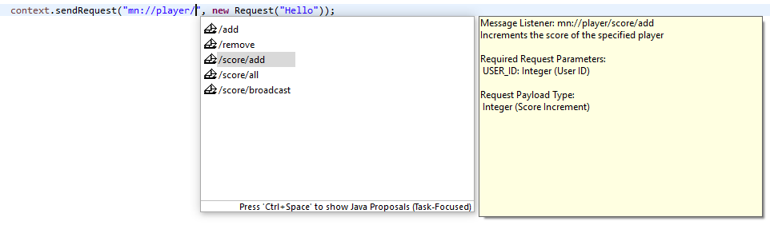
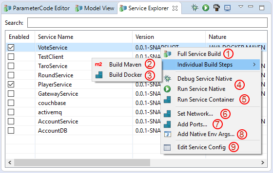
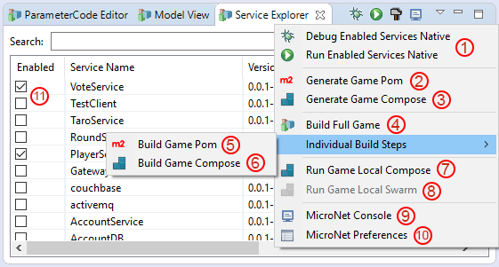

# MicroNet Quick Reference

- [Getting Started Tutorial](../index.md)
- [Quick Reference](index.md)
  - [Shared Model](#shared-model)
  - [Parameter Codes](#parameter-codes)
  - [Shared API](#shared-api)
  - [Launch Utility](#launch-utility)
  - [Game Engine Integration](#game-engine-integration)
  - [Evaluation Survey](#evaluation-survey)

Besides the core Functionality MicroNet provides additional functionality to ease the process of online game development. These concepts are mainly aimed to deal with the complex Microservice topics composition and deployment.

## Shared Model

The main concept behind the composition of a MicroNet application is to use platform independent Shared Model to define datatypes for message transfers and persistence. This concept allows Microservices to use domain objects in a type-safe way neclecting shared game agnostic libraries between services. The developer can define template types which represent the game objects of the game and MicroNet automatically generates POJOS out of the model. This follows the define once, use anywhere approach.

The shared model also features model contribution. Archetypes from the service catalog can define template types which they depend on. These required templates are then automatically contributed to the shared model when the service archetype is added. If you followed the getting started tutorial this process already happened multiple times since several model templaes have been added to the shared model already like `UserValues` for example. The image below shows the Model View for the Simple Example Game. With the Template Tree the Model View provides a way to edit the Shared Model in a convenient way. It is possible to add, remove, and edit templates. 


### Prefab Tree

Prefabs are instances of template objects. Prefabs can be created from model templates and can be organized to a hierarchy of entities. The idea of prefabs is that they can be edited by the designer and then diretly stored in a database to be used at runtime. Prefabs are also planned to implement an observer pattern on object level. This approach will allow the use of reactive programming on a basis of object change notification either for complete objects or for very fine grained access on individual variables of a prefab.

> At this point prefabs are only experimental and are not used for anything. 

## Parameter Codes

A MicroNet message transfer can be augmented by adding parameters to a message. Each parameter of a message is identified by a ParameterCode. The ParameterCodes are global for the whole game application. The following snipplet shows how to add and get parameters from and to a message.

```java
		Request request = new Request();
		request.getParameters().set(ParameterCode.USER_ID, 42);
		int userID = request.getParameters().getInt(ParameterCode.USER_ID);
```

The Parameter Codes of the game application can be edited via the *ParameterCode View*. It is possible to add and remove ParameterCodes. It is also shown in the ParameterCode View which codes are used by which service. Just like Model Templates, required ParameterCodes are contributed to the game workspace when a service is added. The ParameterCode View always contains the three buit in codes: USER_ID, USER_REQUEST, and EVENT. These three codes are used by the framework and cannot be removed.

The image below shows the ParameterCode View for the Simple Example Game. No additional Parameters are used in this example.


## Shared API

MicroNet achieves loose coupling of services by sharing the API in a platform independent way. The so called Service API is a concept that lets the developer document the API of a service directly in the service code using MicroNet annotations and access the API of other services with the Eclipse Code Completion Feature. 

### Documenting the Shared API with Annotations

In addition to the mandatory `@MessageService` and `@MessageListener` annotation, MicroNet provides additional optional annotations to document the API for quick access in other services.

The `@RequestPayload` and `@ResponsePayload` annotations document the type of the message payload. This can be a primitive type or a model type from the Shared Model. Types which are not part of the shared model cannot be used as message payload.

The `@RequestParameters` and `@ResponseParameters` annotations allow to define an array of `@MessageParameter` annotations. Each message parameter must be defined by a ParameterCode along with the class of the payload type.

Generally all MicroNet annotations support a description field to document the functionality of the Shared API in a human readable form.  The Listing below shows an example of a fully annotated message listener function.

```java
@MessageListener(uri="/score/add", desc="Increments the score of the specified player")
@RequestParameters(@MessageParameter(code=ParameterCode.USER_ID, type=Integer.class, desc="UserID"))
@RequestPayload(value = Integer.class, desc = "Score Increment")
public void addScore(Context context, Request request) {
	int userID = request.getParameters().getInt(ParameterCode.USER_ID);
	Player player = players.get(userID);
	int newScore = player.getScore() + Integer.parseInt(request.getData());
	player.setScore(newScore);
	players.update(userID, player);
}
```
### Accessing the Shared API with Code Assist

Once API annotations exist, MicroNet uses this information to present the API to the developer. The complete API is presented in a hierarchical fashion starting with the available services. To test this feature type "mn://" somewhere in a source code and press Ctrl+Space to open the Eclipse Content Assist. You will notice that the full service proposal that is documented is available. The image below shows MicroNet Code Assist in action.



## Launch Utility

MicroNet provides a series of Launch Configurations to ease the life of DevOps engineers. These utility automate major parts of the composition and containerization of MicroNet applications. The MicroNet Launch Utilities are mainly acceessible via the Service Explorer.

Propably the mostly used feature of the Launch Utilities is the **Build All Services**  shortcut. Since MicroNet performs a lot of background activities and specifically code generation, there sometimes might occur issues. To be shure that code generation was performed properly, press the *Build All Services* shortcut manually to invoke the code generation process. This often resolves reference issues. If errors remain the developer has to track them manually. Usually its just imports or package missmatches. In future versions of MicroNet this process will be revisited to make it simpler.

### Service Launch Utilities



### Game Launch Utilities



## Game Engine Integration

The game Engine integration component is only experimental at this point. It will be released in the near future.

## Evaluation Survey

If you have not done it already, please be sure to fill out the [Evaluation Survey](https://docs.google.com/forms/d/e/1FAIpQLSc2mOMse_nsa6kJSQsRMN-ph_sUb4EDws9loc530sVPcMOOsg/viewform?usp=sf_link).
