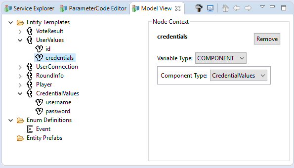
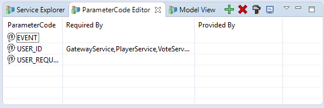

# MicroNet Quick Reference

Besides the core Functionality MicroNet provides additional functionality to ease the process of online game development. These concepts are mainly aimed to deal with the complex Microservice topics composition and deployment.

* [MicroNet Documentation](../index.md)
  * [Getting Started](../gettingstarted/index.md)
  * [Example Game Tutorial](../tutorial/index.md)
  * [Quick Reference](./index.md)

## Shared Model

The main concept behind the composition of a MicroNet application is to use platform independent Shared Model to define datatypes for message transfers and persistence. This concept allows Microservices to use domain objects in a type-safe way neclecting shared game agnostic libraries between services. The developer can define template types which represent the game objects of the game and MicroNet automatically generates POJOS out of the model. This follows the define once use anywhere approach.

The shared model also features model contribution. Archetypes from the service catalog can define template types which they depend on. These required templates are then automatically contributed to the shared model when the service archetype is added. If you followed the getting started tutorial this process already happened multiple times since several model templaes have been added to the shared model already like `UserValues` for example. The image below shows the Model View for the Simple Example Game. With the Template Tree the Model View provides a way to edit the Shared Model in a convenient way. It is possible to add, remove, and edit templates. 



### Prefab Tree

Prefabs are instances of template objects. Prefabs can be created from model templates and can be organized to a hierarchy of entities. The idea of prefabs is that they can be edited by the designer and then diretly stored in a database to be used at runtime. Prefabs are also planned to implement an observer pattern on object level. This approach will allow to use reactive programming on a basis of object change notification either for complite objects or for very fine grained access on individual variables of a prefab.

> At this point prefabs are only experimental and are not used for anything yet. 

## Parameter Codes

A MicroNet message transfer can be augmented by adding parameters to a message. Each parameter of a message is identified by a ParameterCode. The ParameterCodes are global for the whole game application. The following snipplet shows how to add and get Parameters to a from and to a message.

```java
		Request request = new Request();
		request.getParameters().set(ParameterCode.USER_ID, 42);
		int userID = request.getParameters().getInt(ParameterCode.USER_ID);
```

The Parameter Codes of the game application can be edited via the *ParameterCode View*. It is possible to to add and remove ParameterCodes. It is also shown in the ParameterCode View which codes are used by which service. Just like Model Templates, required ParameterCodes are contributed to the game workspace when a service is added. The ParameterCode View always contains the three buit in codes: USER_ID, USER_REQUEST, and EVENT. These three codes are used by the framework and cannot be removed.

The image below shows the ParameterCode View for the Simple Example Game. No additional Parameters are used in this example.



## Shared API

MicroNet achieves loose coupling of services by sharing the API in a platform independent way. The so called Service API is a concept that lets the developer document the API of a service directly in the service code using MicroNet annotations and access the API of other services with the Eclipse Code Completion Feature. 

### Documenting the Shared API with Annotations

In addition to the mandatory `@MessageService` and `@MessageListener` annotation MicroNet provides additional optional annotations to document the API for quick access in other services. 
