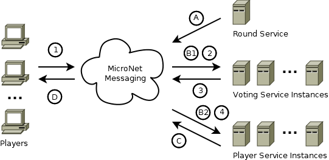

# Simple Example Game

- [Getting Started Tutorial](../index.md)
  - [Installation](../gettingstarted/index.md)
  - [Basic Communication](../communicationtutorial/index.md)
  - [User Management](../usermanagement/index.md)
  - [Simple Example Game](../tutorial/index.md)
    - [Player Session Management](#player-session-management)
    - [Vote and Round Service](#vote-and-round-service)
    - [Testing the Simple Example Game](#testing-the-simple-example-game)
    - [Whats Next](#whats-next)
- [Quick Reference](../quickreference/index.md)

In this last step of MicroNet Getting Statred Tutorials you will add game functionality to build a complete game. The example game is very simple example game application but gives a good overview how to develop games with MicroNet. The example game is played in rounds of 10 seconds where each player can submit a guess and gets points based on the proximity to a random number guessed by the game application. A score ranking of all players is presented to the player in the TestClient.

The communication flow of a game session with the Simple Example game is shown in the image below.



The game round control communication flow (A,B,C,D in the image):

- A. The round service broadcasts a new round event. The new round event contains the guessed number for the next round.
- B1. All voting services receive the new round event and store the next guess number in memory.
- B2. One player service receives the new round event to issue a score broadcast. The scores of all players are available through the session store.
- C. The player service which has received the new round event broadcasts a score update event to all participating players.
- D. Each player receives the score update and updates his scoreboard accordingly. 

The player voting communication flow (1,2,3,4 in the image):
1. The player sends his vote to the game application.
2. The voting service instances compete for the vote messages.
3. The processing voting service instance sends a score update message to an arbitrary player service.
4. The processing player service persists the vote using the session store.
  
## Player Session Management

The design of the Example Game foresees that a player session is created for every player that connects to the game. The Player Service is responsible to provide an interface to access player sessions. Add the *mn-archetype-playerservice* to to the game workspace. Just like the API Gateway Service the Player Service needs access to the session store. So make shure that Couchbase is runnion before you start the PlayerService.

One thing that is left to do for the developer is to decide at what moment the player session is added to the session store. The simplest possibility is to add the session right after a successful login of a User. A place to do that is in the Login Service right before returning the loging response. In the `onLogin` method add the required code to send a message to the *mn://player/add* queue which is observed by the Player Service. The following code snipplet shows how the `onLogin` method looks like after the addition. 

```java
@MessageListener(uri = "/login", desc="Attempt to log in a User.")
@RequestPayload(CredentialValues.class)
@ResponsePayload(value=Integer.class, desc="UserID of the User that logged in")
public Response onLogin(Context context, Request request) {
	CredentialValues credentials = Serialization.deserialize(request.getData(), CredentialValues.class);
	UserValues user = database.getUser(credentials.getUsername());

	if (user == null)
		return new Response(StatusCode.NOT_FOUND);
	if (!credentials.getPassword().equals(user.getCredentials().getPassword()))
		return new Response(StatusCode.UNAUTHORIZED);

	Request addPlayerRequest = new Request(credentials.getUsername());
	addPlayerRequest.getParameters().set(ParameterCode.USER_ID, user.getId());
	context.sendRequest("mn://player/add", addPlayerRequest);

	return new Response(StatusCode.OK, Integer.toString(user.getId()));
}
```
## Vote and Round Service

Add the *mn-archetype-voteservice* and *mn-archetype-roundservice* to the game workspace. Start both services like any other service. Both services have no additional requirement and are good to go. With these two services the Simple Example Game is Complete.

> The Round Service is a little bit special since it has the requirement to be instantiated only once because the Round Control Events may only be broadcasted once. MicroNet does not yet provide a way to limit the number of service instances so the developer is responsible to enshure this.

## Testing the Simple Example Game

To test the game you just developed start the TestClient like you did before in the UserManagement tutorial. After a successful login you will periodically receive new Round updates and get the chance to place a vote. You can also log in with multiple client simultaneously and play against yourself by starting multiple TestClients.

> Note that since the TestClient does not initially download the scoreboard after login so you have to wait for 0-10 seconds for the game to react. The game might appear frozen for a few seconds. This will be fixed in the future. 

## Whats Next

You just completed your fist simple MicroNet game but there is much more you can explore. Refer to the [QuickReference](../quickreference/index.md) page to read more about more advanced MicroNet functionality and concepts. 

Also be shure to fill out the [MicroNet Evaluation Survey](https://docs.google.com/forms/d/e/1FAIpQLSc2mOMse_nsa6kJSQsRMN-ph_sUb4EDws9loc530sVPcMOOsg/viewform?usp=sf_link).
