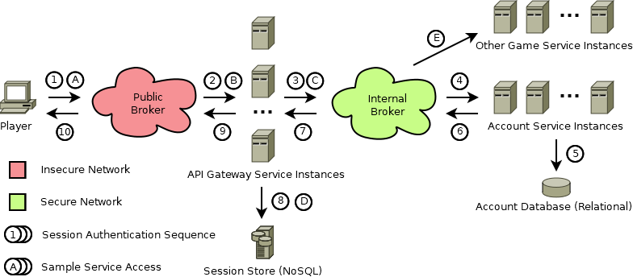

# User Management

- [Getting Started Tutorial](../index.md)
  - [Installation](../gettingstarted/index.md)
  - [Basic Communication](../communicationtutorial/index.md)
  - [User Management](../usermanagement/index.md)
    - [Login Process Overview](#login-process-overview)
    - [Session Store](#session-store)
    - [Gateway Service](#gateway-service)
    - [Account Service](#account-service)
    - [Test Client](#test-client)
    - [Whats Next](#whats-next)
  - [Simple Example Game](../tutorial/index.md)
- [Quick Reference](../quickreference/index.md)

For Users to be able to connect to a MicroNet application the MicroNet *User Management* Infrastructure needs to be available. This infrastructure consists of an API Gateway Service, an Account Service including a relational Account Database, and a Session Store using a NoSQL Database and of course ActiveMQ for networking. This sounds like a lot of stuff but MicroNet makes all these services and technologies available to you in a simple way using containers (Just like you installed ActiveMQ on your system using a container).

Make shure that the ActiveMQ container is running and remove all other running services from previous tutorials.

## Login Process Overview

The Login Process that MicroNet defines is aimed to be as simple as possible and is meant to be adjusted by the develop according to the needs of the a game application. The image below shows the login process along with all actors that take place in it.

1. The user sends a login request to the public broker.
2. One API Gateway polls the message in a competing consumer fashion.
3. The gateway forwards the login message to the internal broker using the mn://account/login queue.
4. One Account Service polls the message in a competing consumer fashion.
5. The Account Service authenticates the user using the Account Database.
6. The account service returns the login response to a temporary queue held open by the responsible gateway.
7. The gateway service consumes the login response from the temporary queue.
8. Upon login success the gateway adds a new player session to the session store, identified by the player connection.
9. The gateway returns the login response to a temporary queue held open by the requesting player.
10. The player consumes the login response from a temporary queue. Upon success he gains access to the game services (example sequence: A, B, C, D, E).

## Session Store

MicroNet uses [Couchbase](https://www.couchbase.com/) as a NoSQL database to provide Session Store capabilities. Think of the session store as a shared data storage used by your Microservices to persist data for a set amount of time or infiniely. The distibuted nature of Couchbase makes it possible to make often used session data highly available among services using eventual consistency concepts.

> Since usually multiple instance of a Microservices are deployed to make Microservice applications reliablilty services not allowed to store session data directly in memory. Instead the session store must be used persist data between request. The result are stateless message transfers.

Add the **mn-archetype-couchbase** archetype to your game workspace using the MicroNet *Service Catalog*. Perform a *Full Service Build* of the Couchbase Service Project from the Service Explorer and afterwards start Couchbase via *Start Serivce Container* in the Service Explorer.

> Important: MicroNet uses a shell script called *wait-for-it.sh* to enshure that required services like activemq are avaible before starting dependent services. This however does not work for couchbase because the ports offered by couchbase are already open during initialization of couchbase and therefore starting couchbase simultaneously with any dependent container leads inevitably to errors. It is therefore recommended to start couchbase prior to any other services to enshure availibility. If anyone finds a solution for this timing issue, please contact me.

## Gateway Service

The Gateway offers the API that is provided by the individual Microservices to the Users of the application. Obviously this service introduces additional security requirements since it has to be accessible from the outside world, the Internet. Up until now all communications have been taking place in a private network not accessible by the outside. All services you introduce are automatically participants of this internal network and therefore all inter service communication is considered secure. To allow external access to services that reside in the internal network, the API Gateway Service comes into play. To keep the internal network secure MicroNet introduces a second public message broker which is generally considered unsecure. Everyone is allowed to connect to this public broker but messages are only forwarded to the internal network on behalf of the API Gateway instances. The API Gateway is implemented as a reverse proxy.

> The two message broker concept is not yet implemented in MicroNet. Momentarily all connections go directly to the internal network which is unsecure. This is also the main reason why it is not advised to use MicroNet for production at it's current stage. Also Encryption is a feature that is not yet supported by MicroNet and also all passwords are stored in plain text. All these security aspects will be covered as soon as possible.

Add the **mn-archetype-gatewayservice** to the game workspace and launch it. Observe how the Gateway Service connects to the Session Store to access the *User Conections* Bucket.

## Account Service

The Account archetype is a Multi-Module Maven archetype and consists of two projects, the AccountService and the AccountDB projects. Add the **mn-archetype-account** archetype to your game workspace. 

> Notice that choosing the acrifactId "Account" results in the Service projects: Account, AccountService, and AccountDB. The Account project it self is not used for anything but is required for the Maven project Hierarchy.

Build and Run the AccountDB as a *Service Container* and start the AccountService project either *Native* or as a *Service Container*. In this case it is necessary to at least start the AccountDB simultaneously with the AccountService to prevent any timimng issues.

## Test Client

If all the services are running you are finally ready to connect to the MicroNet application using a client. Add the **mn-archetype-testclient** archetype from the *MicroNet EXAMPLE Service Catalog* to wour game workspace. The test client is a native Java application providing a little console style UI. To start the TestClient right click the MyGame.TestClient.TestClient.java in the *src/main/java* directory and click *Run/Debug As -> Java Application*.

If everything went well you can register and login at this point... You are online!

## Whats Next

Now that we have basic communication and user management out of the way we can finally move on an implement some gameplay functionality. Continue with the [Simple Example Game](../tutorial/index.md) section.

